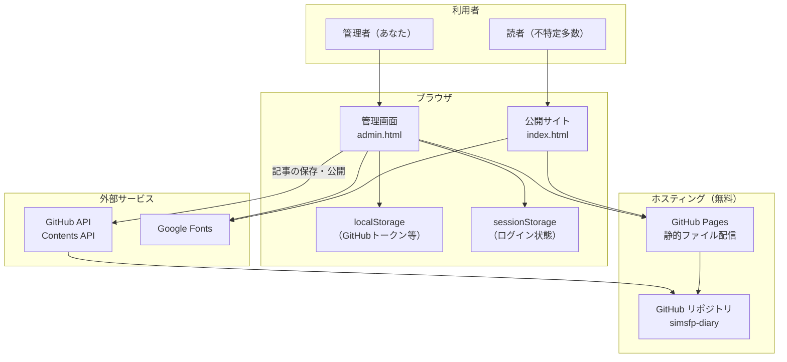
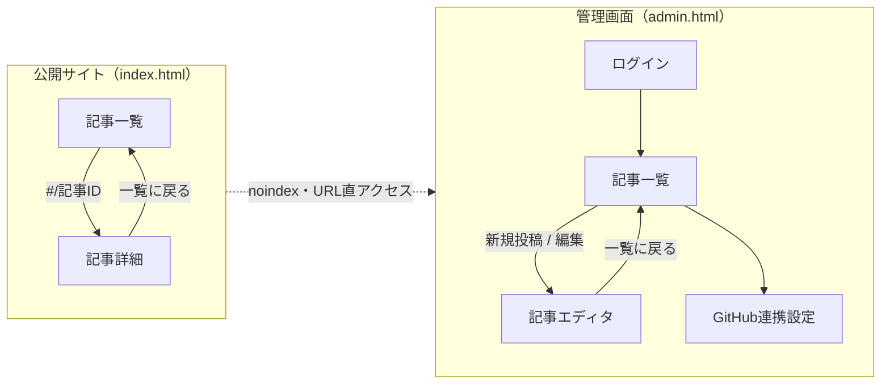
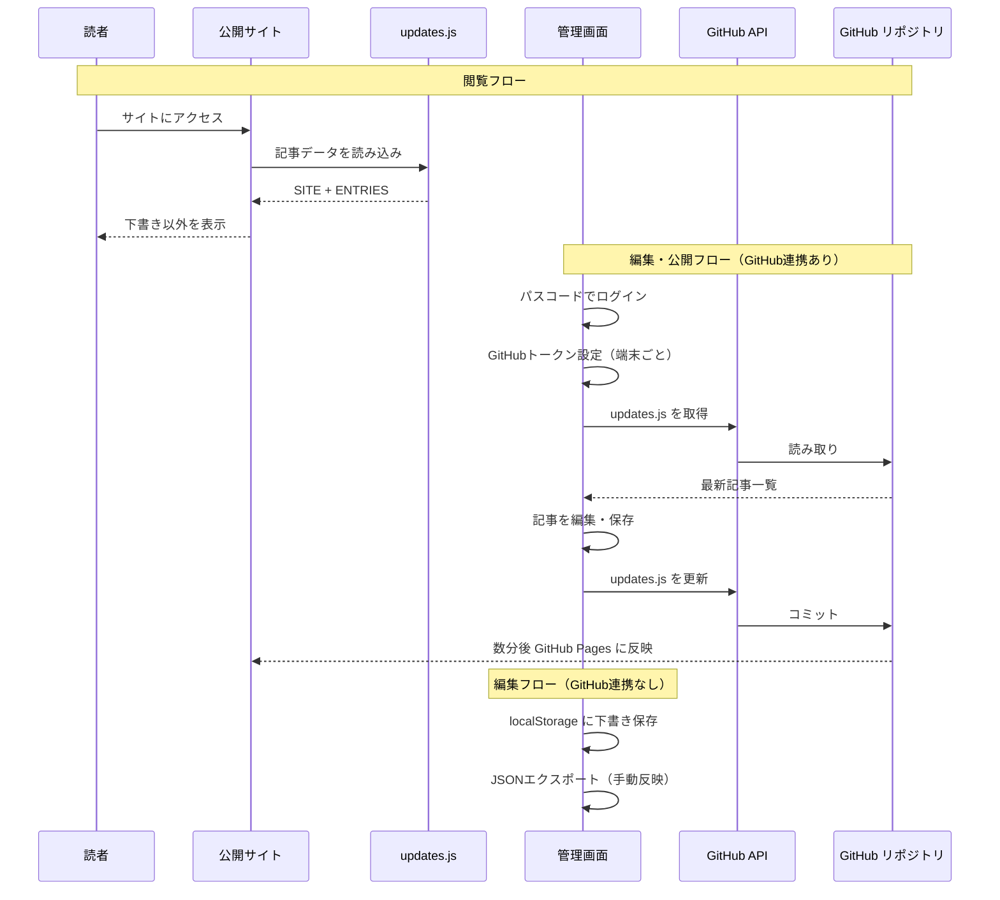
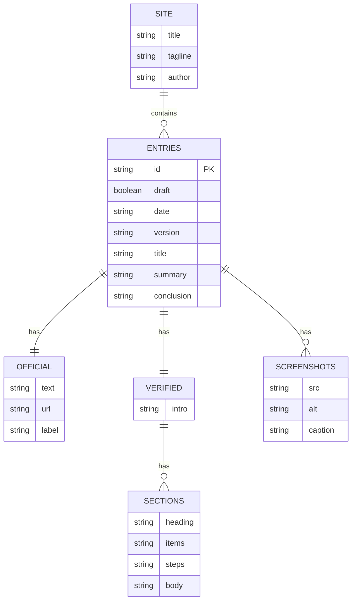
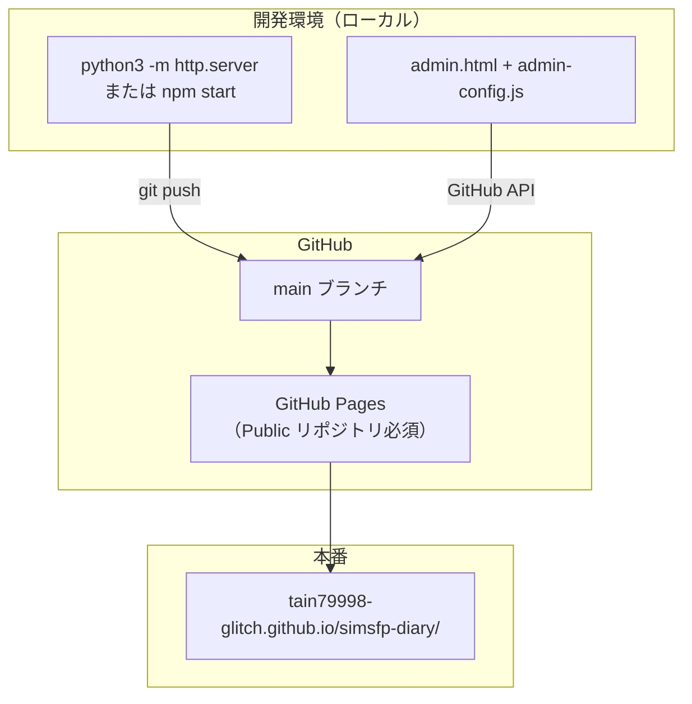
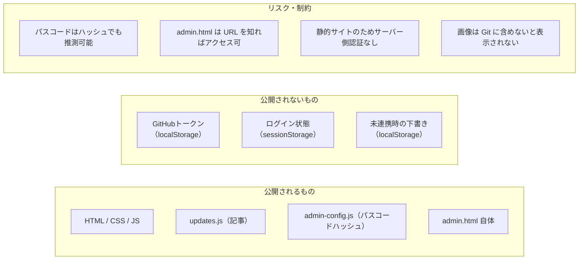

# 要件定義: simsfp-diary

プロジェクト名: simsfp-diary
バージョン: v1.1
最終更新: 2026-06-29

---

## 1. Why（なぜ作る？）

| 項目 | 内容 |
|------|------|
| 目的（1文） | シムズフリープレイのアップデートを、公式サマリに加え自分のプレイ結果で詳しく発信する |
| 背景・課題 | 公式はサマリのみ。操作・体感の詳細が足りない |
| 現状の代替手段 | なし（新規発信） |

---

## 2. What（何を作る？）

| 項目 | 内容 |
|------|------|
| テーマ・題材 | シムズフリープレイのアップデート情報 |
| コンテンツ/機能の種類 | 文章 + スクショ + 数値等（ミックス） |
| 更新頻度 | アップデートのたび |
| コンテンツの形 | ミックス（日記・リスト・レビュー要素） |

---

## 3. Who（誰のため？）

| 項目 | 内容 |
|------|------|
| 主な読者・ユーザー | 同ゲームのプレイヤー（不特定多数） |
| 読者像（1人想像） | 毎日シムズFPをプレイし、パッチ内容を詳しく知りたい人 |
| 訪問者にしてほしいこと | 読む・見るだけ |

---

## 4. How much（どこまで作る？）

### v1 Must（必須）

- [ ] 記事一覧（新しい順）
- [ ] 記事詳細（1アップデート = 1記事）
- [ ] スクショ画像
- [ ] 最新アップデート1本分の記事
- [ ] GitHub Pages で公開

### v1 Want（あれば嬉しい）

- [ ] 公式告知へのリンク（各記事）

### v1 Won't（今回やらない）

- [ ] 検索・タグ・カテゴリ
- [ ] コメント・問い合わせ
- [ ] 更新前後比較 UI
- [ ] 複数ゲーム対応
- [ ] ログイン・会員機能

### MVP（1文）

> 最新アップデート1本分の記事が、ミニマルなデザインで GitHub Pages に公開され、スマホでも読める

---

## 5. How（どう作る？）

| 項目 | 内容 |
|------|------|
| サイト名 | ⚪︎⚪︎の simsfreeplay 日記（例: 慎一郎の simsfreeplay 日記） |
| 技術スタック | HTML / CSS / JavaScript（静的サイト） |
| ホスティング / 公開 | GitHub Pages（無料・Public リポジトリ必須） |
| 更新・運用方法 | 管理画面（`admin.html`）で編集 → GitHub 連携で `updates.js` を自動反映 |
| 参考サイト | なし |
| デザインの雰囲気 | ミニマル・情報重視 |
| スケジュール | 急がない・学びながら |
| 言語 | 日本語のみ（v1） |
| 初回記事 | 最新アップデート |

---

## 6. Done（完成の定義）

> 最新アップデート1本分の記事が、ミニマルなデザインで GitHub Pages に公開され、スマホでも読める

### 完了チェックリスト

```
✅ 何のサイト/プロダクトか1文で言える
✅ 誰が使う/読むか言える
✅ v1 で作る画面/機能が決まっている
✅ v1 で「やらないこと」が決まっている
✅ 最初の1コンテンツ/機能の題材が決まっている
✅ 完成の定義（Done）が書けている
✅ 公開/運用方法が決まっている
```

---

## 7. システム構成（図式化）

機能要件・非機能要件を整理するための、現状（v1.1）のアーキテクチャ図。

### 7.1 システム全体像



| 要素 | 役割 | 要件整理での分類 |
|------|------|------------------|
| 読者 | 記事を閲覧 | 機能要件（公開サイト） |
| 管理者 | 記事の作成・編集・公開 | 機能要件（管理画面） |
| GitHub Pages | 無料ホスティング | 非機能要件（運用・コスト） |
| GitHub API | 別端末からの記事同期 | 機能要件 + 非機能要件（可用性） |
| localStorage | 端末ごとのトークン保存 | 非機能要件（セキュリティ） |

### 7.2 画面構成



| 画面 | URL | 主な機能 |
|------|-----|----------|
| 公開サイト | `/` | 一覧表示、詳細表示、下書き非表示 |
| 管理画面 | `/admin.html` | ログイン、CRUD、GitHub連携、エクスポート |

### 7.3 ファイル・モジュール構成

```mermaid
flowchart TB
    subgraph Pages["HTML"]
        index["index.html"]
        admin["admin.html"]
    end

    subgraph PublicStack["公開サイト JS"]
        updates["updates.js\n（記事データ + SITE設定）"]
        common["common.js"]
        pubStore["public-store.js"]
        app["app.js"]
    end

    subgraph AdminStack["管理画面 JS"]
        config["admin-config.js\n（パスコードハッシュ + GitHub設定）"]
        dataStore["data-store.js"]
        builder["updates-builder.js"]
        ghSync["github-sync.js"]
        adminApp["admin-app.js"]
    end

    subgraph Style["CSS"]
        style["style.css（共通）"]
        adminCss["admin.css（管理専用）"]
    end

    subgraph Assets["静的アセット"]
        images["images/\n（スクショ）"]
    end

    index --> updates & common & pubStore & app & style
    admin --> updates & config & common & builder & ghSync & dataStore & adminApp & style & adminCss

    pubStore --> updates
    dataStore --> updates
    dataStore --> config
    ghSync --> config & builder
    adminApp --> dataStore & ghSync
    app --> pubStore & common
```

```
projects/simsfp-diary/
├── index.html              # 公開サイト
├── admin.html              # 管理画面
├── app.js                  # 公開サイトの表示
├── admin-app.js            # 管理画面のロジック
├── common.js               # 共通ユーティリティ
├── public-store.js         # 公開用データ読み込み
├── data-store.js           # 管理用データ読み書き
├── updates-builder.js      # updates.js の生成・解析
├── github-sync.js          # GitHub API 連携
├── updates.js              # 公開記事データ（Git 管理）
├── admin-config.js         # パスコードと GitHub 設定
├── style.css               # 共通スタイル
├── admin.css               # 管理画面スタイル
├── images/                 # スクショ
└── docs/requirements.md
```

### 7.4 データの流れ



#### データモデル（記事1件）



### 7.5 デプロイ・運用構成



| 運用パターン | 公開サイトへの反映 | 向いている場面 |
|-------------|-------------------|----------------|
| A. GitHub連携あり | 管理画面から自動反映 | スマホ・別PCから編集 |
| B. GitHub連携なし | エクスポート → 手動で `updates.js` 更新 → push | ローカルのみ |
| C. ローカルサーバー | `localhost` で確認 | 開発・下書き確認 |

### 7.6 セキュリティ・制約



### 7.7 要件整理用マトリクス

#### 機能要件（現状実装済み）

| ID | 機能 | 画面 | 関連ファイル |
|----|------|------|-------------|
| F-01 | 記事一覧表示（新しい順） | 公開 | `app.js`, `public-store.js` |
| F-02 | 記事詳細表示 | 公開 | `app.js`, `common.js` |
| F-03 | 下書き非表示 | 公開 | `public-store.js` |
| F-04 | 管理者ログイン | 管理 | `data-store.js`, `admin-config.js` |
| F-05 | 記事 CRUD | 管理 | `admin-app.js`, `data-store.js` |
| F-06 | GitHub 連携・自動公開 | 管理 | `github-sync.js`, `updates-builder.js` |
| F-07 | JSON エクスポート | 管理 | `admin-app.js` |
| F-08 | スマホ対応レイアウト | 両方 | `style.css`, `admin.css` |

#### 非機能要件（現状の制約）

| ID | 項目 | 現状 |
|----|------|------|
| NF-01 | コスト | 無料（GitHub Pages + 静的サイト） |
| NF-02 | 可用性 | GitHub Pages に依存 |
| NF-03 | パフォーマンス | 静的配信、ビルド不要 |
| NF-04 | セキュリティ | クライアント側認証のみ |
| NF-05 | 多端末同期 | GitHub トークン設定が端末ごとに必要 |
| NF-06 | バックアップ | Git リポジトリが正本 |
| NF-07 | SEO | 公開サイトのみ（管理画面は noindex） |
| NF-08 | オフライン | 非対応 |

### 7.8 レイヤー構造

```
┌─────────────────────────────────────────────────────┐
│  プレゼンテーション層                                  │
│  index.html（公開）  /  admin.html（管理）             │
├─────────────────────────────────────────────────────┤
│  アプリケーション層                                  │
│  app.js / admin-app.js                               │
├─────────────────────────────────────────────────────┤
│  ドメイン・データ層                                  │
│  public-store.js / data-store.js / updates.js        │
├─────────────────────────────────────────────────────┤
│  インフラ・外部連携層                                │
│  GitHub Pages / GitHub API / Google Fonts            │
└─────────────────────────────────────────────────────┘
```

---

## サイトマップ

```
/（index.html = 記事一覧 + 記事詳細表示）
/admin.html（管理画面 = ログイン + 記事CRUD + GitHub連携）
images/（スクショ）
```

## 技術構成

v1.0 時点の最小構成から拡張済み。詳細は [7.3 ファイル・モジュール構成](#73-ファイルモジュール構成) を参照。

## ワイヤーフレーム

### トップ（一覧）

- サイト名 + 1行説明
- 記事カード（新しい順）: タイトル / 日付 / 概要

### 記事詳細

- 一覧に戻る
- タイトル / 更新日
- 公式サマリ + リンク
- 実際に確認したこと
- スクショ + キャプション
- まとめ

## 未決定事項

| # | 項目 | 候補 |
|---|------|------|
| 1 | サイトに載せる名前 | 慎一郎 / ニックネーム |

## 変更履歴

| バージョン | 日付 | 変更内容 |
|-----------|------|---------|
| v0.1 | 2026-06-28 | 第1〜2回対話 |
| v1.0 | 2026-06-28 | 確定 |
| v1.1 | 2026-06-29 | 管理画面・GitHub連携・システム構成図を追記 |
